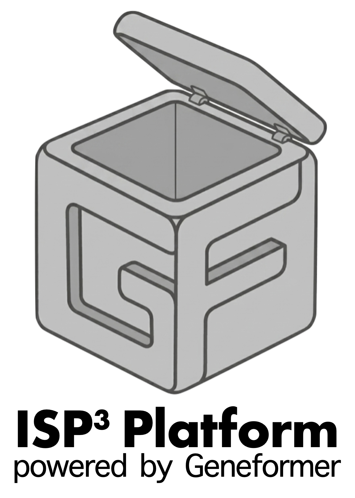
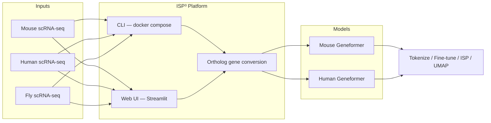

<!-- Keep this logo. Source: docs/logo.png. Do not remove when editing README.md. -->
<p align="center">
  
</p>

# ISP³ Platform

Unified platform for **mouse** and **human** Geneformer workflows with bi-directional species–model switching.

**Release:** v1.0.0 · Docker image `isp-platform:v1.0.0`


Run tokenize, fine-tune, ISP, UMAP, and sequential multi-gene ISP (ordered perturbations, e.g. to mimic iPSC reprogramming steps) from the **CLI** or **Web UI**, both on Docker Compose and Streamlit.

AI tools (Cursor and Antigravity) assisted with code and documentation. The authors reviewed, tested, and modified the generated code and manually verified results.

## Platform scheme

Two Geneformer backends plus **ortholog-based gene-name conversion**, **sequential multi-gene ISP**, and **End-to-End Pipeline** are integrated in a **CLI/WebUI**. Cross-species / sequential experiments can be run from one interface. 

Iwill Put screenshot here/Brief description what it can do


| Backend              | Source                                                                                         | Role                                                                                                                                                                                             |
| -------------------- | ---------------------------------------------------------------------------------------------- | ------------------------------------------------------------------------------------------------------------------------------------------------------------------------------------------------ |
| **Human Geneformer** | [ctheodoris/Geneformer](https://huggingface.co/ctheodoris/Geneformer)                          | Human foundation model: fine-tuning, embeddings, and ISP. Checkpoints **V2-104M** (default here) and **V2-316M**. Native human vocabulary.                                                       |
| **Mouse Geneformer** | [MPRG/Mouse-Geneformer](https://github.com/machine-perception-robotics-group/Mouse-Geneformer) | Mouse scRNA-seq foundation model and token dicts. Checkpoints **base (6L)** and **12L-E20**. Native mouse vocabulary; original workflows were mouse-only notebooks (tokenize / fine-tune / ISP). |





## Status

**Mouse and human input** is fully supported, including bi-directional species–model switching via automatic ortholog mapping.

**Drosophila input is beta.** Remapping fly genes to human or mouse vocabularies typically drops about half of the input genes. Not biologically validated.

All services share one Docker image (`isp-platform`) and the same workflows via **CLI** (`docker compose run …`) and **Web UI** (`docker compose up -d platform_webui` → [http://localhost:8502](http://localhost:8502)). Jupyter Lab is **not** shipped.

## Requirements


| Component             | Requirement                                                                                                               |
| --------------------- | ------------------------------------------------------------------------------------------------------------------------- |
| **GPU**               | NVIDIA GPU with drivers installed                                                                                         |
| **Container runtime** | Docker + [NVIDIA Container Toolkit](https://docs.nvidia.com/datacenter/cloud-native/container-toolkit/install-guide.html) |
| **CPU / OS**          | Linux **x8664** or **aarch64 / ARM64** (e.g. DGX Spark)                                                                   |


Primary testing is on **DGX Spark (aarch64)**; x8664 NVIDIA hosts are supported. Docker selects the matching image architecture.

**Not supported:** CPU-only, non-NVIDIA GPUs, or macOS GPU.

## Install

1. **Clone** and enter the repository:
  ```bash
   git clone https://github.com/YuyaSanaki/ISP-Platform.git
   cd ISP-Platform
  ```
2. **Build the image** (downloads models + dictionaries during build — network required):
  ```bash
   docker compose build isp-platform　#will download models automatically
  ```
   After a successful build you can `docker compose up -d platform_webui` immediately; the entrypoint seeds baked weights into `./models` and `core/geneformer/dicts/` when those host paths are empty. Override the bake profile with an env var **before** `docker compose`, or with `--build-arg`:  Do **not** put `DOWNLOAD_MODELS=…` after the service name — Compose treats that as another service (`no such service: DOWNLOAD_MODELS=all`).

  | Build arg / `.env`        | Meaning                                                                      |
  | ------------------------- | ---------------------------------------------------------------------------- |
  | `DOWNLOAD_MODELS=default` | Mouse base + 12L-E20 + Human V2-104M + dicts + mouse↔human orthologs (~1 GB) |
  | `DOWNLOAD_MODELS=minimal` | Mouse base + mouse dicts only                                                |
  | `DOWNLOAD_MODELS=all`     | `default` + fly ortholog tables (BioMart; slower)                            |
  | `DOWNLOAD_MODELS=none`    | Skip downloads (manual install below)                                        |
  | `HF_TOKEN`                | Optional Hugging Face token if anonymous downloads are rate-limited          |
  | `SKIP_ORTHOLOGS=1`        | Skip Ensembl BioMart during build                                            |

   Re-run after `Dockerfile` or dependency changes. Disk: plan ~1 GB free for the default bake (weights + layer overhead).
3. **(Optional) Manual download** — only if you built with `DOWNLOAD_MODELS=none` or need to refresh host copies:
  ```bash
   bash scripts/download_build_assets.sh              # same as default bake
   # or stage scripts:
   bash scripts/download_mouse_geneformer.sh --prune-bin
   bash scripts/download_human_geneformer_v2_104m.sh
   bash scripts/download_mouse_human_orthologs.sh
   bash scripts/download_drosophila_orthologs.sh      # optional fly
  ```
   See `[models/README.md](models/README.md)`.

**Compose volumes:** `.:/app` keeps code/data live on the host. Image-baked assets live under `/opt/geneformer-assets` and are copied into `/app/models` + `/app/core/geneformer/dicts` on start when missing. Host files always win; set `SKIP_MODEL_SEED=1` to disable copying.

## Quick start (Web UI — Pipeline E2E)

After [Install](#install), run the full **Tokenize → Fine-tune → ISP** pipeline from the browser (same as `run_pipeline.py` on the CLI).

```bash
docker compose up -d platform_webui
```

Open **[http://localhost:8502](http://localhost:8502)** (**ISP³ Platform Web UI**).

On a **remote GPU server**, `localhost` in your laptop browser does not reach the container. Use **SSH port forwarding** (keep the session open):

```bash
ssh -L 8502:localhost:8502 <user>@<server>
```

Then open **[http://localhost:8502](http://localhost:8502)** locally. Or use the server LAN/Tailscale IP (e.g. `http://<server-ip>:8502`) if your network allows it. See [docs/web-ui.md](docs/web-ui.md).

1. **Run type** — start with **FT batch size (calibrate)** (optional but recommended on a new GPU), then **Pipeline (E2E)**.
2. **Study name** — your experiment name (e.g. `MyExperiment`; set **before** uploading the zip).
3. **Data input** — **data.zip** with sample folders (`Time-State-Suffix/`, e.g. `1w-Ctrl-SingleCell/`, `1w-Disease-SingleCell/`), each with `barcodes.tsv.gz`, `features.tsv.gz`, and `matrix.mtx.gz` — or **Download from URL** for a deposited archive. Switching Run type keeps this study loaded.
4. **Species / model** — input data species vs FT/ISP Geneformer (cross-species uses ortholog conversion).
5. **Fine-tune batch size** — after calibration, paste (or **Use calibrated**) the recommended `train_batch_size` on the Pipeline screen. **Once chosen, do not change it** for that study: FT batch size changes optimization dynamics and makes runs hard to compare.
6. **ISP states** — pick **start_state** / **end_state** (e.g. AD, WT) → **Apply setting to Config YAML**. Empty `genes_to_perturb: []` means genome-wide ISP (intentional; can take many hours). Set a gene list in YAML for a targeted run.
7. **Run job** — one E2E job at a time; follow **Logs & status** and **Outputs**. When finished, use **Download figures (.zip)** for PNGs under `output/.../pipeline_*/figures/`.

Workflow and YAML fields: [docs/pipeline.md](docs/pipeline.md).

Iwill Put screenshot here

### Fine-tune batch size (keep fixed)

Fine-tune `train_batch_size` changes the number of optimizer steps per epoch and therefore the learned model. Use Web UI **FT batch size (calibrate)** (or CLI `run_ft_batch_calibrate.py`) once per GPU/model, paste the integer into Pipeline **Fine-tune train_batch_size**, then **do not change it** for comparable runs of the same study. ISP `forward_batch_size` is separate and may stay on Auto.

More detail: [docs/web-ui.md](docs/web-ui.md).

## Usage


#### Users choose:

1. **Model organism** — species of input data: `mouse` | `human` | `drosophila` (**Beta** — not biologically validated)
2. **Model** — which Geneformer to run: `mouse_geneformer` | `human_geneformer`

When `model_organism` does not match the selected model’s native species, an **ortholog gene converter** maps genes from the data organism to the model vocabulary (tokenization and ISP).

At **tokenize**, a **conversion report** (`conversion_report.json`, `conversion_unmapped_genes.tsv`) summarizes mapped vs dropped genes. It runs **by default whenever ortholog conversion applies**; disable with `--no-report-conversion`. The Web UI **Output** tab lists dropped genes with a brief function note. See [docs/tokenization.md](docs/tokenization.md).

For analysis contracts with critical gene sets (e.g. OSKM), enable `ortholog_loss_gate`: it **Blocks** only when a critical gene is **present in the raw input** but dropped by the mapping policy (e.g. POU5F1 under `one2one`). Genes absent from the matrix are **Warn**, not Block. Approval is fail-closed (`ortholog_approval_request.yaml` pending → separate `approval_record.yaml` with `status: approved` via CLI or Web UI card); one-to-many genes are **never** auto-added to curated overlays. Details: [docs/tokenization.md](docs/tokenization.md#ortholog-loss-gate) · [docs/web-ui.md](docs/web-ui.md#ortholog-loss-gate--approval-card-web-ui).

```yaml
species:
  model_organism: mouse          # input data species
  model: human_geneformer        # e.g. run mouse data through human Geneformer
  human_variant: v2_104m         # default human target (v2_316m optional — heavier GPU)
  ortholog_policy: one2one       # cross-species only; leave one2one unless you know otherwise
  # Or for mouse large model:
  # model: mouse_geneformer
  # mouse_variant: 12l_e20       # base | 12l_e20
```

`ortholog_policy` controls many-to-many orthologs (default `one2one`: drop ambiguous pairs, never sum counts). Use `legacy_sum` only to reproduce older last-write-wins + expression-sum behavior.

**Where to set it**

- **Web UI:** Analysis → Pipeline → **Species / model** (policy dropdown only when input ≠ model species; “Which should I pick?” expander). Step-by-step examples + Block **approval card**: [docs/web-ui.md § Species / conversion](docs/web-ui.md#species--conversion-web-ui).
- **YAML:** `species.ortholog_policy` in `core/config/pipeline.yaml` (comments there explain the three options).

**Optional next steps** (not required for current V2-104M / mouse workflows): Human Geneformer **V1** smoke test; manual download / validation of **[V2-316M](https://huggingface.co/ctheodoris/Geneformer)** on a larger GPU.

## Available models

IDs below match YAML (`species.*`) and the Web UI selectors. There is **no fly pretrained Geneformer** — Drosophila input (**Beta**) is remapped via orthologs into a mouse or human checkpoint and has not been biologically validated.

### Pretrained checkpoints


| Model (`species.model`) | Variant id (YAML)   | Web UI label     | Native species | Size / architecture                                          | Checkpoint dir (`models/`)  | Docker bake                           |
| ----------------------- | ------------------- | ---------------- | -------------- | ------------------------------------------------------------ | --------------------------- | ------------------------------------- |
| `mouse_geneformer`      | `base` (default)    | Base (6L / ~10M) | mouse          | ~10M params; **6L** / 256 dim / seq **2048** / SiLU          | `mouse-Geneformer/`         | `minimal`, `default`, `all`           |
| `mouse_geneformer`      | `12l_e20`           | Large (12L-E20)  | mouse          | **12L** / 256 dim / seq **2048** / SiLU (same vocab as base) | `mouse-Geneformer-12L-E20/` | `default`, `all`                      |
| `human_geneformer`      | `v2_104m` (default) | Base (V2-104M)   | human          | ~**104M** params; 12L / 768 dim / seq **4096**               | `human-Geneformer-V2-104M/` | `default`, `all`                      |
| `human_geneformer`      | `v2_316m`           | Large (V2-316M)  | human          | ~**316M** params; 18L / 1152 dim / seq **4096**              | `human-Geneformer-V2-316M/` | not baked — download from HF manually |


Default Compose bake (`DOWNLOAD_MODELS=default`) is ~0.6–0.8 GB of weights + dicts; plan ~1 GB free for layer overhead. See [Install](#install) and `[models/README.md](models/README.md)`.

### Dictionaries and ortholog tables (not checkpoints)


| Asset                                              | Role                                       | Where                                                                     |
| -------------------------------------------------- | ------------------------------------------ | ------------------------------------------------------------------------- |
| Mouse token / median / symbol→Ensembl dicts        | Mouse Geneformer vocabulary                | `core/geneformer/dicts/mouse/` (baked with mouse models)                  |
| Human Genecorpus-104M dicts                        | Human V2 vocabulary                        | `core/geneformer/dicts/human/` (baked with V2-104M)                       |
| Mouse ↔ human orthologs                            | Cross-species remap                        | BioMart TSVs under `core/geneformer/dicts/orthologs/` (`default` / `all`) |
| Fly → human / mouse orthologs                      | Drosophila input → mammal model (**Beta**) | BioMart TSVs; profile `all` (or `download_drosophila_orthologs.sh`)       |
| Curated `*_curated.tsv` + `fly_symbol_to_fbgn.tsv` | Small overrides / symbol helpers           | Tracked in git                                                            |


```yaml
species:
  model_organism: mouse          # mouse | human | drosophila (Beta — unvalidated)
  model: mouse_geneformer        # mouse_geneformer | human_geneformer
  mouse_variant: base            # base | 12l_e20
  # human_variant: v2_104m       # when model: human_geneformer — v2_104m | v2_316m
  ortholog_policy: one2one       # cross-species: one2one | best_of_n | legacy_sum
```


## CLI

**End-to-end** — edit `[core/config/pipeline.yaml](core/config/pipeline.yaml)`, then:

```bash
docker compose run --rm pipeline
```


| Step                          | Command                                                                                          | Doc                                                                             |
| ----------------------------- | ------------------------------------------------------------------------------------------------ | ------------------------------------------------------------------------------- |
| Tokenize                      | `docker compose run --rm tokenize`                                                               | [tokenization.md](docs/tokenization.md)                                         |
| Tokenize + conversion report  | Cross-species tokenize (on by default); `--no-report-conversion` to skip                         | [tokenization.md](docs/tokenization.md)                                         |
| Tokenize + ortholog loss gate | `--ortholog-audit` (+ optional `--ortholog-approval-record`)                                     | [tokenization.md § ortholog loss gate](docs/tokenization.md#ortholog-loss-gate) |
| Fine-tune                     | `docker compose run --rm finetune`                                                               | [fine-tuning.md](docs/fine-tuning.md)                                           |
| ISP                           | `docker compose run --rm isp`                                                                    | [in-silico pertabation.md](docs/in-silico%20pertabation.md)                     |
| ISP UMAP                      | `docker compose run --rm isp_umap`                                                               | [isp_umap.md](docs/isp_umap.md)                                                 |
| Sequential ISP                | `docker compose run --rm sequential_isp`                                                         | [sequential_isp.md](docs/sequential_isp.md)                                     |
| E2E pipeline                  | `docker compose run --rm pipeline`                                                               | [pipeline.md](docs/pipeline.md)                                                 |
| Ad-hoc script (rare)          | `docker compose --profile build run --rm --no-deps isp-platform python3 /app/scripts/...` | —                                                                               |


## Interfaces (Compose services)


| Service                                                         | Role                                                                                            |
| --------------------------------------------------------------- | ----------------------------------------------------------------------------------------------- |
| `platform_webui`                                                | Streamlit control panel (port **8502**; distinct from Mouse-Geneformer-WebUI’s `webui` on 8501) |
| `pipeline`                                                      | Tokenize → Fine-tune → ISP                                                                      |
| `tokenize` / `finetune` / `isp` / `isp_umap` / `sequential_isp` | Stage-only jobs                                                                                 |
| `isp-platform` (`profiles: [build]`)                     | Image build + rare ad-hoc CLI; **not** started by `compose up`                                  |


## Repository layout


| Path                          | Role                                                           |
| ----------------------------- | -------------------------------------------------------------- |
| `core/`                       | Geneformer library, CLI runners, default YAML (`core/config/`) |
| `webui/`                      | Streamlit app + upload / remote-data helpers                   |
| `contracts/`                  | Shared input-layout rules (no GPU / job imports)               |
| `scripts/`, `tests/`, `docs/` | Ops helpers, unit tests, operator docs                         |
| `models/`, `data/`, `output/` | Weights / inputs / run outputs                                 |


See [docs/architecture.md](docs/architecture.md).

## Documentation


| Topic                          | Guide                                                                                                        |
| ------------------------------ | ------------------------------------------------------------------------------------------------------------ |
| **Available models**           | [README — Available models](#available-models) · `[models/README.md](models/README.md)`                      |
| **Tokenization**               | [docs/tokenization.md](docs/tokenization.md) · [ortholog loss gate](docs/tokenization.md#ortholog-loss-gate) |
| **Fine-tuning**                | [docs/fine-tuning.md](docs/fine-tuning.md)                                                                   |
| **ISP**                        | [docs/in-silico pertabation.md](docs/in-silico%20pertabation.md)                                             |
| **E2E pipeline**               | [docs/pipeline.md](docs/pipeline.md)                                                                         |
| **ISP UMAP**                   | [docs/isp_umap.md](docs/isp_umap.md)                                                                         |
| **Sequential ISP**             | [docs/sequential_isp.md](docs/sequential_isp.md)                                                             |
| **Web UI (details)**           | [docs/web-ui.md](docs/web-ui.md)                                                                             |


## Upstream / related repos

- **Mouse Geneformer (research):** [machine-perception-robotics-group/Mouse-Geneformer](https://github.com/machine-perception-robotics-group/Mouse-Geneformer) — original pretraining **notebooks** and model publication ([bioRxiv](https://www.biorxiv.org/content/10.1101/2024.09.09.611960v1)). Use that repo for notebook-style exploration; this platform is CLI/Web UI only.
- **Mouse-Geneformer-WebUI:** [YuyaSanaki/Mouse-Geneformer-WebUI](https://github.com/YuyaSanaki/Mouse-Geneformer-WebUI) — deprecated mouse-only Web UI; workflows are integrated into this platform.
- **Human Geneformer:** [ctheodoris/Geneformer](https://huggingface.co/ctheodoris/Geneformer) — human foundation model and documentation at [geneformer.readthedocs.io](https://geneformer.readthedocs.io/en/latest/).
- **Mouse Genecorpus-20M:** [MPRG/Mouse-Genecorpus-20M](https://huggingface.co/datasets/MPRG/Mouse-Genecorpus-20M) — pretraining corpus and token dictionary for mouse workflows.

