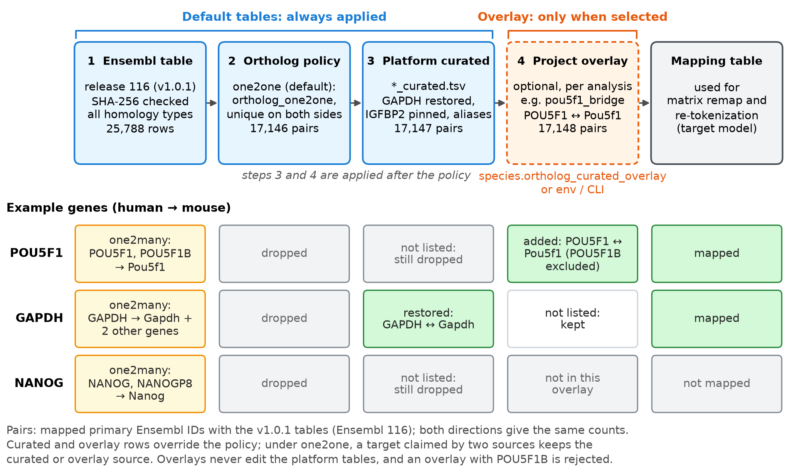

# Ortholog mapping tables

Tab-separated `source_id` → `target_id` mappings used by `geneformer.gene_converter`.
Optional third column `orthology_type` (from BioMart) is used when present.

| File | Use |
|------|-----|
| `mouse_to_human.tsv` | Full Ensembl mouse→human map (`scripts/download_mouse_human_orthologs.sh`; includes `orthology_type`) |
| `mouse_to_human_curated.tsv` | Symbol aliases + corrected Ensembl pairs (merged **after** main table; overrides BioMart) |
| `human_to_mouse.tsv` | Human→mouse Ensembl pairs (same download; includes `orthology_type`) |
| `human_to_mouse_curated.tsv` | Human symbol aliases → mouse Ensembl |
| `drosophila_to_*.tsv` | Full fly→human / fly→mouse maps (`scripts/download_drosophila_orthologs.sh`; includes `orthology_type`) |
| `core/geneformer/dicts/drosophila/fly_symbol_to_fbgn.tsv` | Fly symbol → `FBgn` for ISP (`p53`/`Tp53`→`FBgn0039044`, `Brca2`→`FBgn0050169`) |
| `*_curated.tsv` | Same merge rule for every conversion pair |

**Fly aliases:** do not invent mammal gene names (`Igfbp2`) for fly IDs. `FBgn0283477` is SF2, not IGFBP2; `FBgn0004644` is hedgehog (`hh`), not p53. True fly p53 (`FBgn0039044`) is BioMart `ortholog_one2many` to the p53 family → dropped under default `one2one`.

## Quick pick (`species.ortholog_policy`)

Only used when **input species ≠ model species**. Same-species runs ignore it.

| Value | Pick when… | Effect |
|-------|------------|--------|
| `one2one` (**default**) | Unsure / normal analysis | Keep clear 1:1 only; never sum counts |
| `best_of_n` | Want fewer genes dropped | Among N→1, keep highest-median gene |
| `legacy_sum` | Reproducing an old run | Old last-write-wins + expression sum |

Web UI: **Species / model** controls → dropdown appears only for cross-species runs  
YAML: `species.ortholog_policy` in `core/config/pipeline.yaml`

Many-to-many BioMart rows are resolved at **load / remap** time:

| Policy | 1→N (one source, many targets) | N→1 (many sources, one target) |
|--------|--------------------------------|--------------------------------|
| `one2one` (**default**) | Drop ambiguous sources | Drop ambiguous primary IDs; **never sum** counts |
| `best_of_n` | Deterministic pick (lexicographically smallest target) | Keep source with **highest median** expression; no sum |
| `legacy_sum` | Last-write-wins | **Sum** expression (old behavior; distorts Geneformer ranks) |

```yaml
species:
  model_organism: mouse
  model: human_geneformer
  ortholog_policy: one2one   # one2one | best_of_n | legacy_sum
```

When `orthology_type` is present in the TSV, `one2one` prefers rows labeled `ortholog_one2one`, then still requires unique source/target among primary IDs.

## Resolution order (`resolve_gene_for_model`)

1. Ortholog table on user input (symbol or Ensembl — curated wins over main).
2. Input symbol → input Ensembl (species symbol dict) → ortholog.
3. Passthrough if already model-native Ensembl / `FBgn`.

**Igfbp2 / IGFBP2 (mouse↔human only):** curated maps to human `ENSG00000115457` and mouse `ENSMUSG00000039323` so tokenization, ISP, and UMAP stay consistent (BioMart Ensembl-only pairs may differ). There is no fly `Igfbp2` alias.

**Gapdh / GAPDH:** curated keeps `ENSMUSG00000057666` ↔ `ENSG00000111640`. Without it, one2one drops mouse Gapdh (collision with `Gm*` rows) and human→mouse can resolve to `Gm10358`.

**Curated Ensembl overrides:** only add an Ensembl→Ensembl row when BioMart is wrong for that gene. Symbol aliases (e.g. `Tp53` / `Trp53` / `Brca2` / `Gapdh`) are fine; they must point at the correct target IDs and must not remap unrelated genes (e.g. Lypla1 / Maoa / Gnai3).

## Default tables and overlays



`load_ortholog_table` builds the mapping for a cross-species run in this order:

1. **Ensembl table** (`human_to_mouse.tsv` / `mouse_to_human.tsv`): downloaded from the current Ensembl BioMart release; all homology types.
2. **Ortholog policy** (`species.ortholog_policy`, default `one2one`): ambiguous one-to-many / many-to-one rows are dropped.
3. **Platform curated table** (`*_curated.tsv`): always applied; restores or pins specific pairs (GAPDH, IGFBP2) and adds symbol aliases.
4. **Project overlay** (optional): applied only when `species.ortholog_curated_overlay` (or env / CLI) is set.

Steps 1–3 are the **default tables**: they are applied to every cross-species run. Steps 3 and 4 run after the policy, so their rows survive `one2one`; when two sources claim the same target, the curated or overlay source is kept. An overlay never edits the platform files.

| Gene (human → mouse) | Ensembl | After `one2one` | After platform curated | After `pou5f1_bridge` overlay |
|------|---------|-----------------|------------------------|-------------------------------|
| POU5F1 | one2many (POU5F1, POU5F1B → Pou5f1) | dropped | dropped | mapped |
| GAPDH | one2many (GAPDH → Gapdh + 2 other genes) | dropped | mapped | mapped |
| NANOG | one2many (NANOG, NANOGP8 → Nanog) | dropped | dropped | dropped |

The counts in the diagram are for the Ensembl 116 tables pinned in v1.0.1 (each direction: 25,788 rows → 17,146 one2one pairs → 17,147 after the platform curated table → 17,148 with `pou5f1_bridge`); other releases give different counts.

## Project curated overlays (analysis-scoped)

Platform `*_curated.tsv` files stay global. Analysis projects may add an **explicit overlay** without editing them:

| Mechanism | Example |
|-----------|---------|
| YAML | `species.ortholog_curated_overlay: /app/analysis/.../ortholog_policy/v1` |
| Env | `GENEFORMER_ORTHOLOG_CURATED_OVERLAY=...` |
| CLI | `--ortholog-curated-overlay ...` (tokenize / pipeline) |

If the path is a **directory**, the loader picks `curated_bridge_{pair}.tsv` (e.g. `curated_bridge_human_to_mouse.tsv`). Overlay rows are merged **after** the platform curated TSV. Prefer Ensembl ID→ID rows for reproducibility.

**Example overlay:** `examples/ortholog_overlays/pou5f1_bridge/` is the POU5F1 ↔ Pou5f1 bridge (`ENSG00000204531` ↔ `ENSMUSG00000024406`, both directions; paralog POU5F1B `ENSG00000212993` excluded) used for the cross-species runs of the ISP Platform paper. Ensembl labels the pair `ortholog_one2many`, so `one2one` drops POU5F1 without it. To reproduce that conversion, set `species.ortholog_curated_overlay: /app/examples/ortholog_overlays/pou5f1_bridge` (Docker) or the repository path.

## Ortholog loss gate

Tokenize can run `ortholog_loss_gate` when `tokenizer.ortholog_audit` is set. **Block** = critical gene **present in input** but dropped by policy (e.g. POU5F1 one2many under one2one). Absent-from-input criticals are **Warn** only. The gate does **not** auto-write overlay / curated rows — use an explicit overlay + approval choice **B**.

Operator docs: [docs/tokenization.md](../../../../docs/tokenization.md#ortholog-loss-gate).
